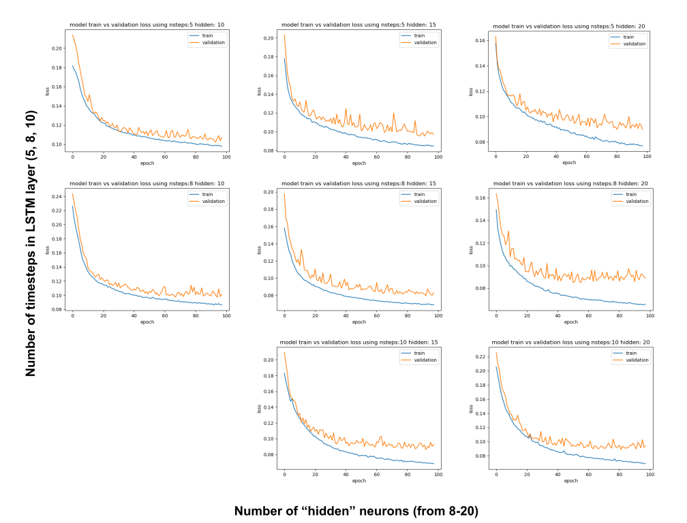

{: .mx-auto.d-block :}


There will be more details here at some point...for now check out our blog posts!
testsetsetset


## Project Overview
For our final project, we wanted to get more experience with applying machine learning to learn a control policy in robots, so we chose dodgeball as our area of focus due to how scalable it was - we could start with a simple model where a simple differential drive robot learns how to dodge a ball thrown straight at it, and could go as far as implementing this on a drone with balls thrown at it from all directions. Ultimately, we were able to train two different types of models using imitation learning, where we recorded a dataset of us playing dodgeball then trained the model to imitate what we did. Over the course of this project, we looked into 
[Long-Short Term Memory models (LSTM)](https://www.tensorflow.org/api_docs/python/tf/keras/layers/LSTM)
and 
[standard neural networks](https://pytorch.org/tutorials/beginner/blitz/neural_networks_tutorial.html). 
Using these models, we were able to train a differential drive robot to dodge 2 balls with some degree of success. 

LSTM: [insert best here]
Standard: [insert best results here]

Taking a closer look at our model, it’s clear that it works well when balls come at it from the right or the left, but it struggles when the balls come at it head on 
[insert gif here]

It would be difficult to visualize a more complicated neural network with several layers to understand why this is happening, but we can look at the simple case where we just have a 1 layer. This simple net has a similar behavior as the more complicated one, so let’s take a closer look at the output weights
```
[-1.2466,  0.2136,  0.0509, -0.0623, -0.7231]
px         py       vx      vy      bias
```

We can see here that the primary driver is the px value - if the ball comes from right, this net outputs a strong command to drive to the left.

It’s also interesting that this net seemed to learn about human reflexes - it pauses a bit before making a move
[insert gif here]
Interestingly enough, these output weights do also tell that story - between the bias term and the py - py’s average max value was approximately 3, and 0 meant that the robot was about to get hit. It’s worth noting that 3*0.2136 (py weight) approximately equals 0.7231 (magnitude of the bias term), which means that when the ball is far away the bias attempts to negate the effect of the y position. However, as the ball gets closer, the signal becomes more negative, encouraging the robot to move to the left.
